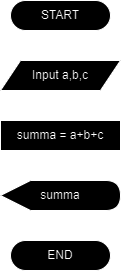

## Задание 1

[тест с ответами](https://docs.google.com/document/d/1sfbc3JVURU5wGZlHlh5a_-5pa9uOogkLKbSadTtMA-0/edit?usp=sharing)

## Задание 2

#### Псевдокод для алгоритма сложения трёх чисел: 
сложить три числа и вывести сумму.

```
input a, b, c
summa = a + b + c
output summa
```
#### Блок-схема алгоритма



#### Реализация в коде на Java

```java
public class Main {
    public static void main(String[] args) {
        int a = 5 , b = 10 , c = 15;

        int summa = a + b + c;

        System.out.println("Сумма : " + summa);
    }
}
```
